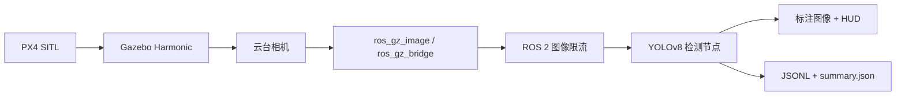

# 2026CV 低空目标识别仿真系统

基于 **PX4、Gazebo Harmonic、ROS 2 Jazzy 和 YOLOv8** 的无人机低空目标识别项目。系统从 Gazebo 相机获取图像，经 ROS 2 桥接和限流后完成目标检测，并输出带 HUD 的图像、结构化检测结果和运行指标。

> 当前状态：实时感知链路已完成并可演示；自建数据集训练、长时间稳定性和真实无人机验证仍在继续。

## 系统链路



## 已实现内容

- PX4 SITL 与 Gazebo 自定义场景、云台相机模型联调
- Gazebo 相机图像到 ROS 2 话题的桥接
- 基于 YOLOv8 的 ROS 2 实时检测节点
- 图像限流、检测框、FPS、延迟和状态 HUD
- 终端实时仪表盘与检测结果 JSONL/JSON 记录
- 随机目标生成、随机航点飞行和仿真数据采集代码
- Windows GPU 训练环境与 Ubuntu CPU 推理环境分离
- 针对内存、Swap、磁盘写入和 GPU 驱动问题的稳定性排查

## 运行环境

项目使用 Ubuntu 24.04、ROS 2 Jazzy、Gazebo Harmonic 和 PX4 v1.16。Ubuntu 环境保存在移动硬盘中，并通过 VirtualBox 制作和运行；虚拟机无法直接使用宿主机 RTX 4050，因此训练在 Windows 上进行，ROS 2 推理在 Ubuntu 中运行。

PX4 源码不包含在本仓库中，默认位置为：

```text
~/PX4/PX4-Autopilot
```

## 快速开始

```bash
git clone https://github.com/starliliko/px4-ros2-yolo-simulation.git
cd px4-ros2-yolo-simulation

# 创建 Ubuntu 推理环境
bash vision/setup_infer_env.sh

# 下载官方 YOLOv8n 基线权重（权重不提交到 Git）
source vision/.venv-train/bin/activate
bash scripts/download_model.sh

# 启动 PX4、Gazebo 和 ROS 2 感知链路
bash scripts/launch_all.sh
```

如果 PX4 和 Gazebo 已在其他终端运行，也可以只启动 ROS 2 感知链路：

```bash
bash scripts/run_demo.sh
```

查看标注图像：

```bash
bash scripts/view_annotated.sh
```

详细依赖和复现步骤见 [docs/reproduction.md](docs/reproduction.md)。

## 仓库结构

```text
.
├── docs/       # 架构、复现、状态和排障文档
├── demo/       # 演示说明；运行输出默认不提交
├── ros2_ws/    # low_altitude_bringup ROS 2 包
├── sim/        # Gazebo 模型、世界、目标生成和飞行任务
├── vision/     # YOLO 环境、离线推理、训练和结果汇总
└── scripts/    # 启动、检查、模型下载和稳定性脚本
```

## 当前限制

- VirtualBox 环境中只能进行 CPU 推理，实时帧率受主机资源限制。
- 当前使用官方 `yolov8n.pt` 作为基线；自建仿真数据集和微调模型尚未形成完整可复现实验。
- 已在现有资源条件下完成约 10 分钟连续运行验证，但尚未完成长时间稳定性测试。
- 当前仅完成仿真感知链路，尚未在真实无人机上部署，也未实现检测结果驱动的闭环控制。

最新状态与后续工作见 [docs/status.md](docs/status.md)。

## 项目贡献与 AI 使用说明

本项目由本人独立完成，包括仿真环境搭建、ROS 2 通信链路、YOLOv8 推理节点、可视化界面、运行脚本及系统联调。开发过程中使用 AI 工具辅助资料检索、故障分析、代码编写与文档整理；最终设计决策、集成调试和结果验证由本人完成。

## 文档

- [系统架构](docs/architecture.md)
- [环境与复现](docs/reproduction.md)
- [当前状态](docs/status.md)
- [常见问题与排障](docs/troubleshooting.md)

## License

[MIT](LICENSE)
