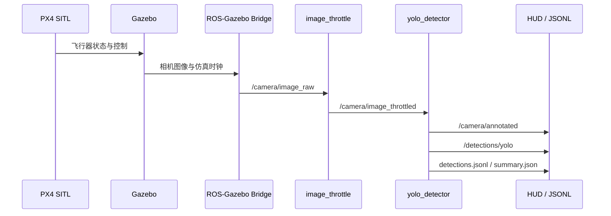

# 系统架构

## 目标

项目验证从无人机仿真相机到目标检测结果的完整感知链路。PX4 负责飞行器仿真，Gazebo 提供世界、目标和相机图像，ROS 2 负责数据传输与节点编排，YOLOv8 完成推理。

## 数据流

## 主要模块

| 模块 | 位置 | 职责 |
|---|---|---|
| 仿真资源 | `sim/custom_gz/` | 自定义世界、云台和相机模型 |
| 目标生成 | `sim/launch/spawn_targets.py` | 在 Gazebo 中随机放置目标并记录清单 |
| 飞行任务 | `sim/missions/random_waypoints.py` | 通过 MAVSDK 执行随机航点任务 |
| ROS 2 启动 | `ros2_ws/src/low_altitude_bringup/launch/` | 启动桥接、限流、检测和采集节点 |
| 检测节点 | `low_altitude_bringup/yolo_detector.py` | 加载 YOLO、推理、发布与记录结果 |
| 可视化 | `hud.py`、`dashboard.py` | 生成图像 HUD 和终端仪表盘 |
| 运行统计 | `metrics.py`、`results_recorder.py` | 统计 FPS、延迟、类别数量并持久化 |
| 离线工具 | `vision/` | 模型环境、离线推理、训练和报告生成 |

## ROS 2 接口

| 话题 | 类型 | 方向 |
|---|---|---|
| `/clock` | `rosgraph_msgs/Clock` | Gazebo → ROS 2 |
| `/camera/image_raw` | `sensor_msgs/Image` | 相机桥接输出 |
| `/camera/image_throttled` | `sensor_msgs/Image` | 限流节点 → 检测节点 |
| `/camera/annotated` | `sensor_msgs/Image` | 检测节点 → 可视化 |
| `/detections/yolo` | `std_msgs/String` | 检测节点 → JSON 状态与结果 |

当前检测结果使用 JSON 字符串发布，适合演示和快速迭代。若后续接入跟踪或闭环控制，应替换为正式的自定义 ROS 2 消息。
